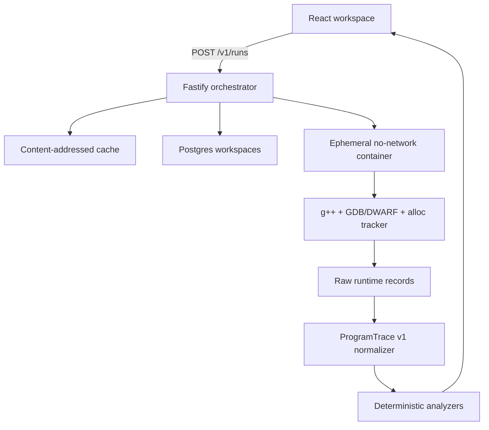

# SeePlusPlus

SeePlusPlus turns **observed C++ execution** into a synchronized view of source
lines, stack frames, variables, heap allocations, pointer edges, object
lifetimes, console output and memory-safety findings.

This is a clean-room implementation inspired by the public architecture of the
Stanford CS194 See++ project. It does not copy that project's application code
or branding. Runtime state is obtained from a compiled inferior through
GDB/DWARF plus a linked `new`/`delete` allocation tracker; regular expressions
are never used to invent stack, heap or pointer state.

> **GitHub Pages scope:** the Pages build is an interactive UI demonstration
> with explicitly labelled golden test fixtures. GitHub Pages is static hosting
> and cannot safely compile or execute arbitrary C++. Use the local Docker stack
> for real runs.

## What works

- C++17/C++20 single-file compilation with `g++ -g3 -O0` and sanitizers.
- Real line stepping, calls, returns, recursion and source-mapped frames via GDB.
- Locals, parameters, scalars, pointers, references, arrays and struct fields
  from DWARF metadata.
- `new`/`new[]` and `delete`/`delete[]` event capture with allocation generations.
- Heap graph derived generically from pointer fields—no hard-coded list/tree parser.
- Leak, reachability, dangling-pointer and sanitizer-backed failure analysis.
- Timeline playback, stack/heap inspection, call stack, lifetime lanes, console and
  evidence-linked diagnostics.
- Compile/runtime/timeout/output/tracer failure taxonomy.
- Anonymous workspace create/read/update/fork API with Postgres or memory adapter.
- Content-addressed, gzip-compressed trace cache with SHA-256 integrity checks.
- Hardened per-run container policy: no network, read-only root, bounded tmpfs,
  non-root user, dropped capabilities, CPU/memory/PID/output/time limits.

See [supported C++](docs/supported-cpp.md) for exact tested and experimental
coverage. Threads and user-defined global allocators are explicitly unsupported.

## Architecture



The canonical contract lives in `packages/trace-schema`. The UI never consumes
raw debugger output. See [architecture](docs/architecture.md) and the
[trace protocol](docs/trace-protocol.md).

## Run locally

Requirements: Docker Desktop with Linux containers and at least 2 GB free RAM.

```bash
git clone https://github.com/Apepsis/SeePlusPlus.git
cd SeePlusPlus
cp .env.example .env
docker compose up --build
```

Open <http://localhost:4000>. API health is available at
<http://localhost:3000/v1/health>.

On Windows, run the same commands in PowerShell after Docker Desktop reports
that its engine is running. `failed to connect to the Docker API` means Docker
Desktop is closed or still starting.

The Compose setup mounts the Docker socket into the API **for local development
only** so it can start a fresh restricted runner container per request. Do not
use that topology in production; use a separate runner service, Lambda or a
microVM-backed job system.

## Developer workflow

```bash
corepack enable
pnpm install
pnpm typecheck
pnpm test
pnpm build
pnpm test:runner       # requires Docker
pnpm test:security     # requires Docker
```

The static demonstration can be tested with:

```bash
VITE_DEMO_MODE=true VITE_API_URL= pnpm --filter @seeplusplus/web build
pnpm --filter @seeplusplus/web preview
```

## GitHub Pages

The `pages.yml` workflow builds the web app with `VITE_DEMO_MODE=true` and the
repository base path. In repository settings, choose **Settings → Pages → Build
and deployment → Source: GitHub Actions**. The resulting URL is:

`https://apepsis.github.io/SeePlusPlus/`

The deployed UI can inspect and animate bundled golden fixtures. The **Run**
button explains why edited code requires the local API instead of pretending
that Pages executed it.

## Repository map

```text
apps/web                 React + CodeMirror visualization workspace
apps/api                 Fastify orchestration and workspace API
packages/trace-schema    Zod contract, TypeScript types, JSON Schema
packages/memory-model    pointer/reachability indexes
packages/analyzer        deterministic findings and evidence
packages/graph-engine    semantic graph + Dagre layout adapter
engine/trace-normalizer  raw runtime records -> ProgramTrace v1
engine/tracer-adapters   isolated runner port and Docker adapter
runner/local             pinned compiler/GDB runner image
db/migrations            normalized Postgres schema
examples                 semantic and adversarial C++ corpus
infra                    security policy and cloud blueprint
docs                     architecture, support matrix and validation
```

## Security boundary

User C++ never runs in the Node API process. The API passes a typed request over
stdin to an ephemeral container with no network or inherited application
secrets. This repository is a defensible baseline, not a claim that containers
are a perfect hostile-code boundary. A public high-risk deployment should use a
dedicated runner host or Firecracker-class isolation and repeat the adversarial
suite after every toolchain change. See [threat model](docs/threat-model.md).

## Project status

The local real-execution MVP, static Pages demo, schema, analyzers, graph engine,
persistence migration, cache, CI and security harness are implemented. AWS
resources are an infrastructure blueprint and are not deployed by this repo;
deployment requires the owner's AWS account, domain, images and OIDC role.
Exact evidence and remaining limits are tracked in
[IMPLEMENTATION_STATUS.md](docs/IMPLEMENTATION_STATUS.md).

## License and provenance

Application code in this repository is MIT licensed. The implementation does
not embed SPP-Valgrind or Valgrind-derived code. It invokes stock GNU GDB as a
separate tool inside the runner image; review the distribution licenses of the
container's Debian/GNU packages when publishing images.

The name of the original project is used only for factual reference. This
repository is not affiliated with or endorsed by Stanford University or the
original See++ maintainers.

## References

Nazir, K., Taylor, A., Wang, L., Yang, M., & Chang, M. (2026). _See++: A C++
visualization tool_ [Computer software]. GitHub.
https://github.com/knazir/SeePlusPlus

Free Software Foundation. (n.d.). _Debugging with GDB_. GNU Project.
https://sourceware.org/gdb/current/onlinedocs/gdb.html

DWARF Debugging Information Format Committee. (n.d.). _DWARF debugging
information format_. https://dwarfstd.org/

Open Worldwide Application Security Project. (2025). _OWASP Application
Security Verification Standard 5.0_. https://owasp.org/www-project-application-security-verification-standard/
