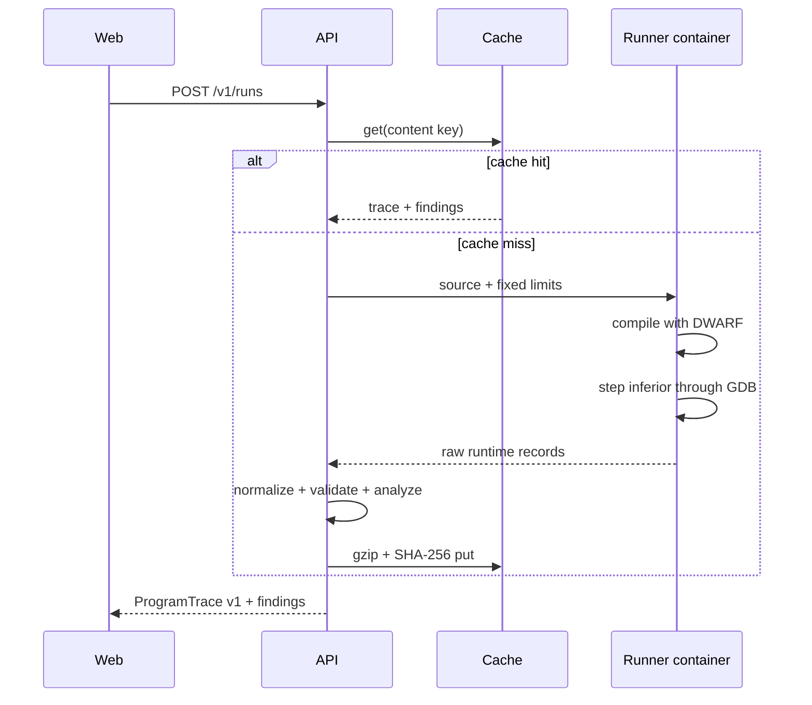

# Architecture

## Boundaries and dependency direction

The browser owns editing, playback and rendering. It accepts only a validated
`ProgramTrace` and `Finding[]`. The API owns quotas, run IDs, caching,
normalization and persistence. The runner owns compilation and debugger
instrumentation but receives no database or cloud credentials.

`trace-schema` is the stable interoperability boundary. `memory-model` and
`analyzer` are pure packages. `graph-engine` converts runtime values into
semantic nodes/edges and then applies layout through an adapter. No layout
coordinates enter the trace schema.

## Run sequence

## Runtime truth

GDB reads variables and frames from the stopped inferior and its DWARF debug
metadata. A separately linked allocator translation unit logs `new` and
`delete` events. The normalizer assigns `(address, generation)` identities,
resolves pointer values against live/freed generations and derives deltas.

Known boundary: stack-pointer targets are shown as observed numeric addresses
but do not become heap-object nodes. Heap content is typed when a visible pointer
allows GDB to dereference the allocation. Unsupported or unreadable values are
explicitly `unavailable`; they are never guessed.

## Evolution points

- Replace `DockerRunner` with Lambda, ECS jobs or microVM worker without changing
  the raw runner protocol.
- Add an LLVM/LLDB tracer adapter without changing `ProgramTrace v1` where the
  same semantics are available.
- Replace full snapshots with periodic snapshots plus deltas only under a new or
  backward-compatible materialization layer.
